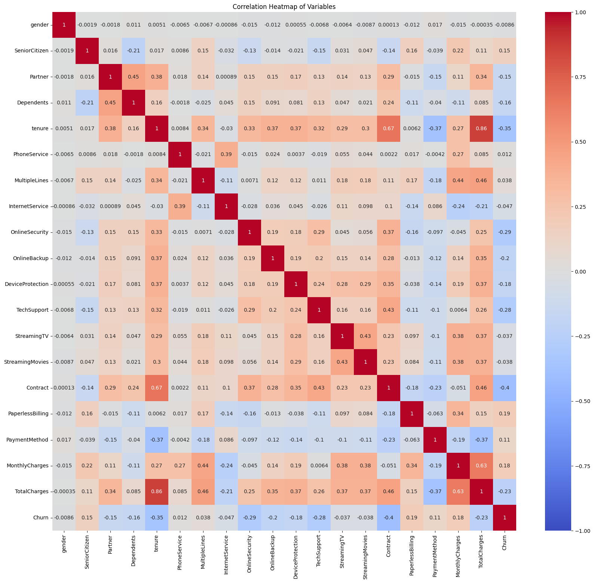

The contributors to this Hackathon Challenge are: 
<a href ="https://github.com/EnockCity"> Enock Mbaraka </a>  
<a href ="https://github.com/EstherNjuguna"> Esther Njuguna </a>
<h1> TeleCommunication Churn </h1>

<h2>Executive Summary </h2>
This hackathon involves involves creating a model to predict retention of customers in Telecommunication companies.
Data was gotten from Kaggle Website. 

We developed several models however only logistic regression gave viable results.

Logistic regression model gave an accuracy of 80 percent,indicating it performed fairly well on the dataset.

The classification report metrics potrayed accurate predictions indicating a relatively performance of the model.
<h3> Data definition </h3>
<ol>
<li>Gender: The customer’s gender: Male, Female</li>
<li>Senior Citizen: Indicates if the customer is 65 or older: Yes, No</li>
<li>Partner: Indicates if the customer is married: Yes, No</li>
<li>Dependents: Indicates if the customer lives with any dependents: Yes, No. Dependents could be children, parents, grandparents, etc.</li>
<b>Services That Company Offers</b>
<li>PhoneService: Whether the customer has a phone service or not (Yes, No)</li>
<li>Multiple Lines: Indicates if the customer subscribes to multiple telephone lines with the company: Yes, No</li>
<li>Internet Service: Indicates if the customer subscribes to Internet service with the company: No, DSL, Fiber Optic, Cable.</li>
<li>Online Security: Indicates if the customer subscribes to an additional online security service provided by the company: Yes, No</li>
<li>Online Backup: Indicates if the customer subscribes to an additional online backup service provided by the company: Yes, No</li>
<li>Device Protection: Indicates if the customer subscribes to an additional device protection plan for their Internet equipment provided by the company: Yes, No</li>
<li>Tech Support: Indicates if the customer subscribes to an additional technical support plan from the company with reduced wait times: Yes, No</li>
<li>Streaming TV: Indicates if the customer uses their Internet service to stream television programing from a third party provider: Yes, No. The company does not charge an additional fee for this service.</li>
<li>Streaming Movies: Indicates if the customer uses their Internet service to stream movies from a third party provider: Yes, No. The company does not charge an additional fee for this service.
Customer Account Information</li>
<li>Tenure: Number of months the customer has stayed with the company</li>
<li>Contract: Indicates the customer’s current contract type: Month-to-Month, One Year, Two Year.</li>
<li>Paperless Billing: Indicates if the customer has chosen paperless billing: Yes, No</li>
<li>Payment Method: Indicates how the customer pays their bill: Bank Withdrawal, Credit Card, Mailed Check</li>
<li>Monthly Charge: Indicates the customer’s current total monthly charge for all their services from the company.</li>
<li>Total Charges (Approximately equal to tenure * monthly_charge): Indicates the customer’s total charges, calculated to the end of the quarter specified above.</li>
<li>Churn Label: Yes = the customer left the company this quarter. No = the customer remained with the company. Directly related to Churn Value.</li>
<h3> Business Problem </h3>
To predict the churn possibility of a customer from the telecommunication company.

<h3> Data Preprocessing </h3>

 We took time to understand the data and clean it.
Some of the tasks we did:  
1. Handling missing values - We used median as our imputation for this data  
2. Categorical data was encoded  
3. Columns we demeaned would have correlation were dropped.  

<h3> Modelling </h3>

 We used various algorithms to create predictions. Some had very poor output but Logistic Regression gave an accuracy of 81% 

 Top 3 features contributing to the prediction:
'MonthlyCharges', 'TotalCharges', 'Contract' 

<h3> Conclusion </h3>

We hope to continue to fine tune the model 

